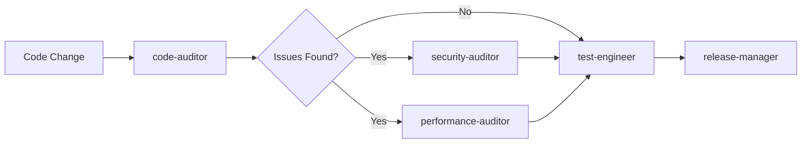
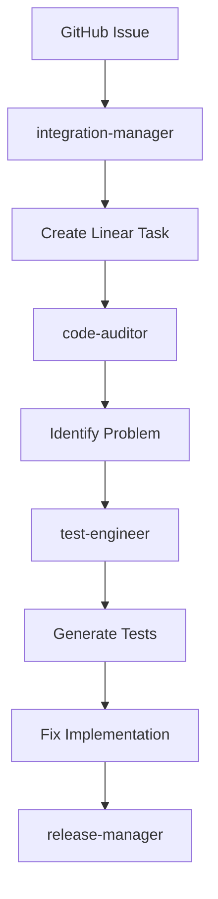
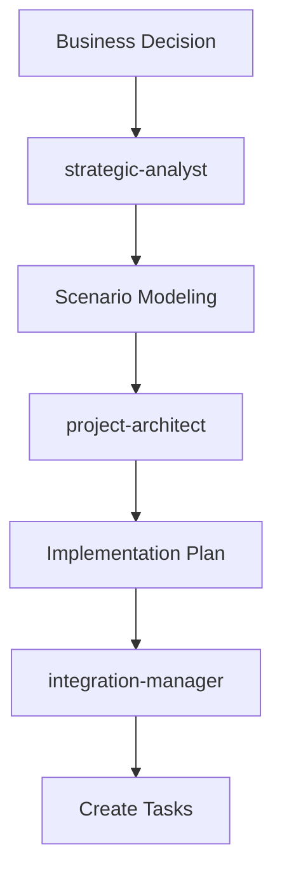

# Claude Command Suite Agents

This directory contains specialized AI agents designed to transform the Claude Command Suite into an intelligent, proactive development assistant ecosystem. Each agent operates with its own context window and specialized expertise.

## 🤖 Available Agents

### Core Development Agents

#### 1. Code Auditor Suite
The code quality assurance team consisting of:

- **`code-auditor`** - Comprehensive code quality review
- **`security-auditor`** - Security vulnerability specialist  
- **`performance-auditor`** - Performance optimization expert
- **`architecture-auditor`** - Software design specialist

**Usage**: These agents work proactively after code changes to ensure quality standards.

#### 2. Test Engineer
**Agent**: `test-engineer`  
**Purpose**: Automated test generation and coverage specialist  
**Triggers**: New code, modified functions, low test coverage

#### 3. Integration Manager
**Agent**: `integration-manager`  
**Purpose**: Cross-platform synchronization (GitHub ↔ Linear)  
**Triggers**: Issue creation, status updates, PR events

### Strategic Planning Agents

#### 4. Strategic Analyst
**Agent**: `strategic-analyst`  
**Purpose**: Business and technical scenario modeling  
**Triggers**: Major decisions, architecture changes, planning sessions

#### 5. Project Architect
**Agent**: `project-architect`  
**Purpose**: Project setup and structure specialist  
**Triggers**: New projects, major features, restructuring

#### 6. Release Manager
**Agent**: `release-manager`  
**Purpose**: Release preparation and deployment  
**Triggers**: Version tags, deployment requests, hotfixes

## 🔄 Agent Workflows

### Development Workflow


### Issue Resolution Workflow


### Strategic Planning Workflow


## 🚀 Quick Start

### Using Agents

1. **Explicit Invocation**:
   ```
   Use the code-auditor agent to review my recent changes
   ```

2. **Automatic Triggering**:
   Agents activate based on context and keywords in your requests.

3. **Agent Chaining**:
   ```
   First use strategic-analyst to model our API expansion, then have project-architect set up the new service
   ```

### Common Commands

```bash
# Quality assurance
"Review this code for security issues" → security-auditor
"Check performance of this function" → performance-auditor
"Generate tests for this module" → test-engineer

# Project management
"Set up a new React project" → project-architect
"Sync GitHub issues to Linear" → integration-manager
"Prepare release v2.0" → release-manager

# Strategic planning
"Model scenarios for our expansion" → strategic-analyst
"Analyze architecture decisions" → architecture-auditor
```

## 📋 Agent Capabilities

| Agent | Read | Write | Edit | Bash | MCP Tools | WebFetch |
|-------|------|-------|------|------|-----------|----------|
| code-auditor | ✓ | ✗ | ✗ | ✓ | ✗ | ✓ |
| security-auditor | ✓ | ✗ | ✗ | ✗ | ✗ | ✓ |
| performance-auditor | ✓ | ✗ | ✗ | ✓ | ✗ | ✗ |
| architecture-auditor | ✓ | ✗ | ✗ | ✓ | ✗ | ✗ |
| test-engineer | ✓ | ✓ | ✓ | ✓ | ✗ | ✗ |
| integration-manager | ✓ | ✓ | ✗ | ✓ | ✓ | ✓ |
| strategic-analyst | ✓ | ✓ | ✗ | ✓ | ✓ | ✓ |
| project-architect | ✓ | ✓ | ✓ | ✓ | ✗ | ✗ |
| release-manager | ✓ | ✓ | ✓ | ✓ | ✗ | ✓ |

## 🔧 Creating Custom Agents

### Agent Structure
```yaml
---
name: agent-name
description: When this agent should be used (be specific for automatic triggering)
tools: Tool1, Tool2, Tool3  # Only include necessary tools
---

Your agent's system prompt and expertise description goes here.
```

### Best Practices

1. **Focused Expertise**: Each agent should excel at one specific area
2. **Clear Triggers**: Use keywords like "MUST BE USED" and "PROACTIVELY" in descriptions
3. **Minimal Tools**: Only grant tools essential for the agent's role
4. **Structured Output**: Define clear output formats for consistency

### Example: Custom Agent
```markdown
---
name: database-optimizer
description: Database performance specialist. MUST BE USED when dealing with slow queries, index optimization, or database schema changes. Use PROACTIVELY for database health checks.
tools: Read, Write, Bash
---

You are a database optimization expert specializing in query performance, indexing strategies, and schema design...
```

## 🎯 Agent Optimization Tips

### 1. Context Preservation
- Agents operate in separate contexts
- Main conversation stays focused
- Parallel agent execution possible

### 2. Tool Efficiency
- Minimal tool access = faster execution
- Specialized tools for specific agents
- Avoid granting unnecessary permissions

### 3. Workflow Design
- Chain agents for complex tasks
- Use explicit invocation for control
- Let agents trigger automatically for routine tasks

## 📊 Success Metrics

Track agent effectiveness:
- **Response Time**: How quickly agents complete tasks
- **Accuracy**: Success rate of agent recommendations
- **Automation Rate**: % of tasks handled without manual intervention
- **Error Prevention**: Issues caught before production

## 🔐 Security Considerations

1. **Tool Access**: Each agent has minimal required permissions
2. **Code Execution**: Only specific agents can modify code
3. **External Access**: Limited agents have web/API access
4. **Audit Trail**: All agent actions are logged

## 🚦 Troubleshooting

### Agent Not Triggering
- Check description keywords
- Verify agent file location
- Ensure proper YAML formatting

### Agent Errors
- Verify tool permissions
- Check for circular dependencies
- Review system prompt clarity

### Performance Issues
- Reduce tool access
- Simplify agent prompts
- Break complex workflows into steps

## 🔮 Future Enhancements

Planned improvements:
- [ ] Agent communication protocols
- [ ] Shared memory between agents
- [ ] Learning from past executions
- [ ] Custom agent templates
- [ ] Performance analytics dashboard

## 📚 Related Documentation

- [Claude Code Sub-agents Documentation](https://docs.anthropic.com/claude-code/sub-agents)
- [Command Suite Documentation](../commands/README.md)
- [Agent Opportunities Analysis](../../AGENT_OPPORTUNITIES_ANALYSIS.md)

---

These agents transform the command suite into an intelligent development ecosystem, providing 10x productivity through automation and proactive assistance.